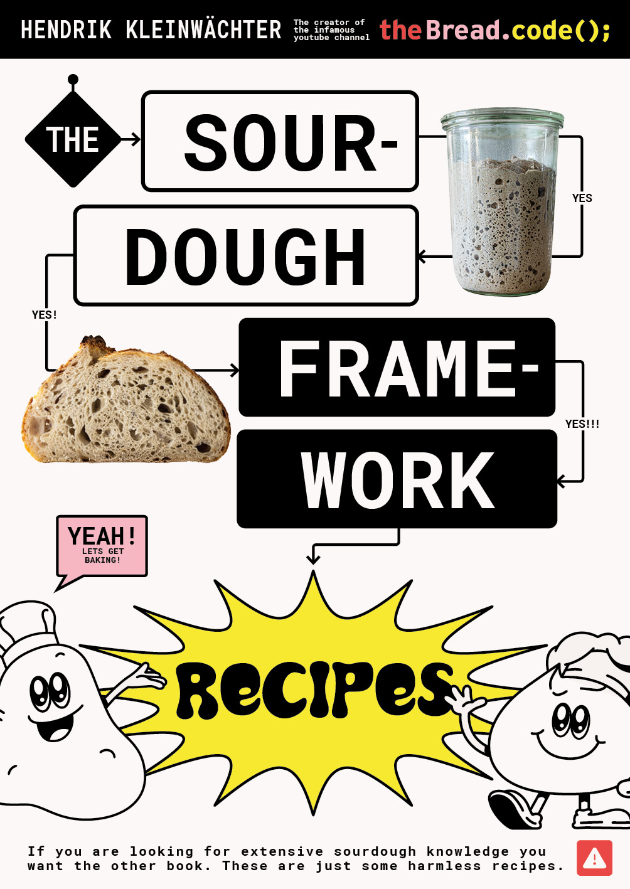

# The Sourdough Framework Recipes

The Sourdough Framework Recipes is an open-source recipe book dedicated to
enabling you to bake the best possible bread at home.



## Background

4 years after launching the repositories [the-bread-code](https://github.com/hendricius/the-bread-code)
, [pizza-dough](https://github.com/hendricius/pizza-dough)
and [the-sourdough-framework](https://github.com/hendricius/the-sourdough-framework) I
created this project to provide you with easy recipes to bake sourdough bread and yeast-based bread at home.
It is recommended to read The Sourdough
Framework first as it is the basis for the recipes in this book.


## 🍞 Baking the book (Docker)

```console
make
```

Then you can check out the file `book/book.pdf`

If you want to 🍞 bake all the versions including ebook variants (.pdf, .epub), run:

```console
make bake
```

You can check the files in  the folder `book/release/`

You can get some help on building various versions with:

```console
cd book/
make help
```
## Download

* [Download .pdf](https://the-bread-code.io/book-recipes.pdf)
* [Download .epub](https://the-bread-code.io/book-recipes.epub)

## Support

Did you find a typo, or feel the wording could be improved?
Feel free to open up a pull request at any time.

I believe that the knowledge this book provides is essential to everyone.
That's why I decided to open source my knowledge hoping
that it will reach more people all over the world without
budget constraints.

If you would like to contribute with a small donation you can do so
via my [ko-fi page.](https://breadco.de/book-recipes) Your donation will tremendously
help me to cover costs related to running theBread.code();. It furthermore allows
me to dedicate time to continuously update and improve this book.

## Links

* [The Sourdough Framework](https://github.com/hendricius/the-sourdough-framework)
* [My YouTube channel](https://youtube.com/c/thebreadcode)
* [Ask a question on Discord](https://breadco.de/discord)

## License

This work is licensed under a [Creative Commons Attribution-ShareAlike 4.0
International License][cc-by-sa].

[![CC BY-SA 4.0][cc-by-sa-image]][cc-by-sa]

[cc-by-sa]: http://creativecommons.org/licenses/by-sa/4.0/
[cc-by-sa-image]: https://licensebuttons.net/l/by-sa/4.0/88x31.png
[cc-by-sa-shield]: https://img.shields.io/badge/License-CC%20BY--SA%204.0-lightgrey.svg
